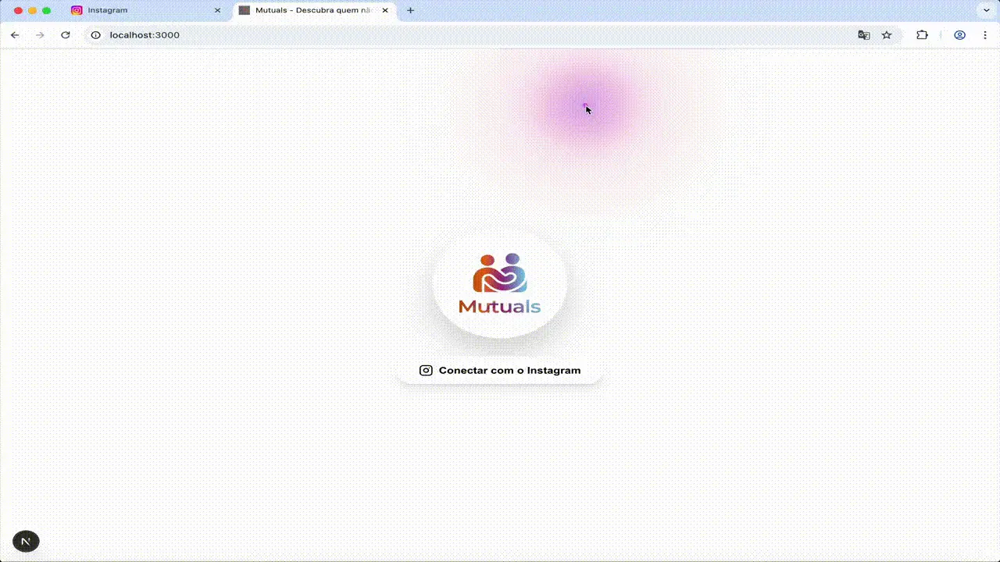

<div align="center">
  

  # Mutuals
  
  **Descubra quem não te segue de volta no Instagram.**
  
  [](https://nextjs.org/)
  [](https://reactjs.org/)
  [](https://www.typescriptlang.org/)
  [](https://tailwindcss.com/)
  [](https://www.framer.com/motion/)

</div>

<br />

## 📋 Table of Contents

- [Sobre](#-sobre)
- [Demo](#-demo)
- [Funcionalidades](#-funcionalidades)
- [Como Usar](#-como-usar)
- [Instalação e Execução](#-instalação-e-execução)
- [Tecnologias](#-tecnologias)

---

## 🚀 Sobre

**Mutuals** é uma Single Page Application (SPA) moderna e segura que permite aos usuários do Instagram identificar facilmente quais contas eles seguem mas que não os seguem de volta. 

Diferente de outros aplicativos, o Mutuals foca na **privacidade e segurança**: todo o processamento de dados é feito **localmente** no navegador do usuário. Não há login via API do Instagram e nenhum dado é enviado para servidores externos.

---

## 🎥 Demo

<div align="center">
  
</div>

---

## ✨ Funcionalidades

- **Processamento Local**: Análise de dados feita inteiramente no navegador.
- **Upload de Dados**: Suporte para upload dos arquivos JSON oficiais do Instagram (`following.json` e `followers_1.json`).
- **Lista de Não-Seguidores**: Visualização clara de quem não te segue de volta.
- **Cards Interativos**: Links diretos para os perfis no Instagram.
- **Gerenciamento de Lista**: Marque usuários como removidos ("Delete") localmente para organizar sua limpeza.
- **Interface Moderna**: Design responsivo com animações fluidas, modo escuro e efeitos visuais de mouse.
- **Privacidade Total**: Seus dados nunca saem do seu dispositivo.

---

## 📖 Como Usar

1. **Exporte seus dados do Instagram**:
   - Vá em "Sua atividade" > "Baixar suas informações".
   - Selecione "Baixar ou transferir informações".
   - Escolha "Algumas de suas informações" e selecione "Seguidores e seguindo".
   - Escolha "Baixar para o dispositivo".
   - **Importante**: Selecione o formato **JSON**.

2. **Faça o Upload**:
   - No Mutuals, clique em "Conectar com o Instagram".
   - Arraste e solte os arquivos `following.json` e `followers_1.json` (ou o ZIP contendo eles).

3. **Gerencie**:
   - Veja a lista de quem não te segue de volta.
   - Clique nos cards para abrir o perfil e deixar de seguir manualmente no Instagram.
   - Clique em "Delete" no app para remover o usuário da lista visual.

---

## 💻 Instalação e Execução

Para rodar o projeto localmente, siga os passos abaixo:

### Pré-requisitos

- Node.js (versão 18 ou superior)
- npm, yarn, pnpm ou bun

### Passo a Passo

1. **Clone o repositório**

```bash
git clone https://github.com/seu-usuario/mutuals.git
cd mutuals
```

2. **Instale as dependências**

```bash
npm install
# ou
yarn install
# ou
pnpm install
```

3. **Rode o servidor de desenvolvimento**

```bash
npm run dev
# ou
yarn dev
# ou
pnpm dev
```

4. **Acesse o projeto**

Abra [http://localhost:3000](http://localhost:3000) no seu navegador para ver o resultado.

---

## 🛠 Tecnologias

O projeto foi construído utilizando as seguintes tecnologias:

- **[Next.js 14](https://nextjs.org/)**: Framework React para produção.
- **[React](https://reactjs.org/)**: Biblioteca para construção de interfaces.
- **[TypeScript](https://www.typescriptlang.org/)**: Superset JavaScript com tipagem estática.
- **[Tailwind CSS](https://tailwindcss.com/)**: Framework CSS utilitário.
- **[Framer Motion](https://www.framer.com/motion/)**: Biblioteca de animações para React.
- **[Lucide React](https://lucide.dev/)**: Biblioteca de ícones.

---

<div align="center">
  Feito com ❤️ por <a href="https://github.com/GDauer">GDauer</a>
</div>
